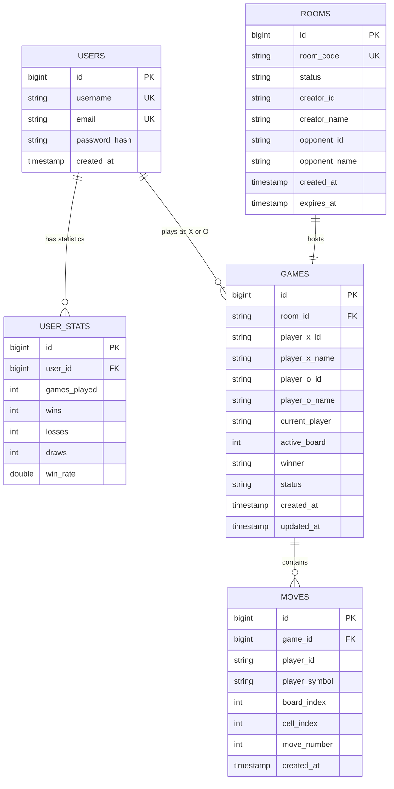
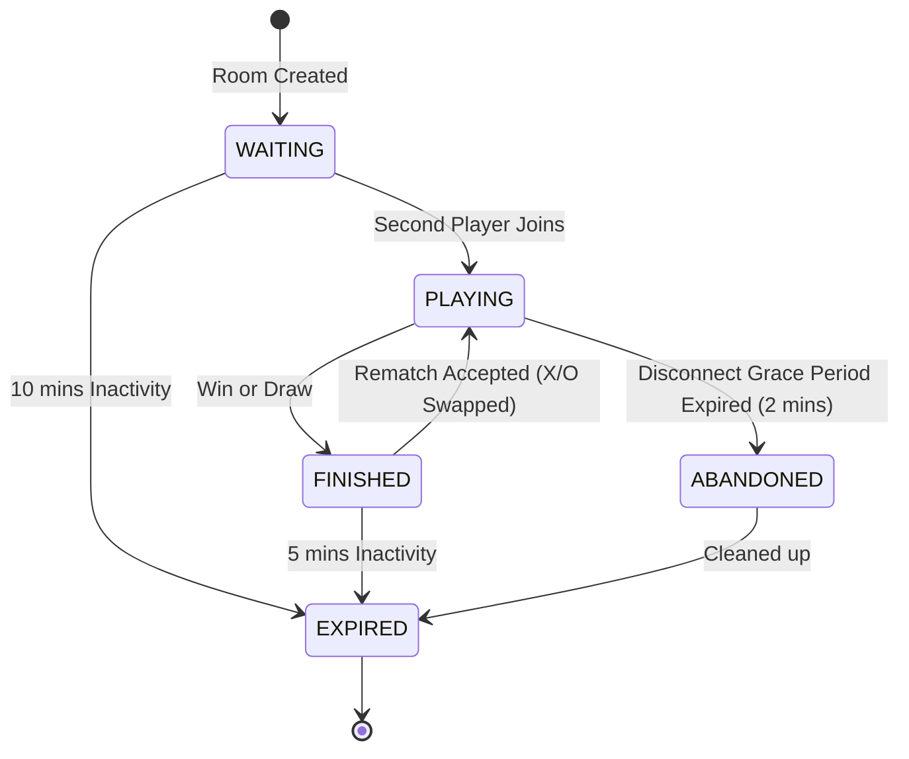

# Implementation Plan - Super Tic-Tac-Toe Full-Stack Web Application

## Overview & Architecture Blueprint

Super Tic-Tac-Toe is a 9x9 strategic game consisting of a 3x3 grid of smaller 3x3 boards (81 cells total). The application is built using a modern full-stack web architecture:
- **Frontend**: React.js with CSS Modules / modern CSS and React Router.
- **Backend**: Spring Boot (Java) with Spring Web, Spring Security (JWT), Spring Data JPA, and Spring WebSocket.
- **Database**: MySQL for persistence of registered users, statistics, game history, and active rooms/games.
- **Real-Time Layer**: WebSockets (STOMP over SockJS/Native WebSockets) for zero-latency gameplay, move validation, live state sync, reactions, and player connection tracking.

---

## 1. System Architecture Diagram

```mermaid
graph TD
    subgraph Client ["Frontend (React SPA)"]
        UI["React UI Components"]
        Router["React Router"]
        AxiosClient["REST Client (Axios / Fetch)"]
        WSClient["WebSocket Client (STOMP / SockJS)"]
    end

    subgraph Security ["Security & Auth Layer"]
        JWTFilter["JWT Authentication Filter"]
        SecurityConfig["Spring Security Config"]
    end

    subgraph Backend ["Backend (Spring Boot)"]
        RESTControllers["REST Controllers (/api/auth, /api/rooms, etc.)"]
        WSEndpoints["WebSocket Handlers (/ws/game)"]
        GameEngine["Super Tic-Tac-Toe Game Engine Service"]
        RoomManager["Room & Player Manager Service"]
        Scheduler["Scheduled Tasks (Room Cleanup)"]
    end

    subgraph Data ["Data Layer"]
        JPARepos["Spring Data JPA Repositories"]
        MySQL [("MySQL Database")]
    end

    UI --> Router
    UI --> AxiosClient
    UI --> WSClient

    AxiosClient -->|HTTP Headers: Authorization Bearer| JWTFilter
    JWTFilter --> SecurityConfig
    SecurityConfig --> RESTControllers

    WSClient -->|STOMP WS Connection| WSEndpoints

    RESTControllers --> RoomManager
    RESTControllers --> GameEngine
    WSEndpoints --> GameEngine
    Scheduler --> RoomManager

    GameEngine --> JPARepos
    RoomManager --> JPARepos
    JPARepos --> MySQL
```

---

## 2. Complete Folder Structure

### 2.1 Backend Project Structure (`supertictactoe-backend`)

```
supertictactoe-backend/
├── pom.xml
├── src/
│   ├── main/
│   │   ├── java/com/supertictactoe/
│   │   │   ├── SuperTicTacToeApplication.java
│   │   │   ├── config/
│   │   │   │   ├── SecurityConfig.java
│   │   │   │   ├── WebSocketConfig.java
│   │   │   │   ├── CorsConfig.java
│   │   │   │   └── AppProperties.java
│   │   │   ├── controller/
│   │   │   │   ├── AuthController.java
│   │   │   │   ├── UserController.java
│   │   │   │   ├── RoomController.java
│   │   │   │   └── GameWebSocketController.java
│   │   │   ├── service/
│   │   │   │   ├── AuthService.java
│   │   │   │   ├── UserService.java
│   │   │   │   ├── RoomService.java
│   │   │   │   ├── GameEngineService.java
│   │   │   │   └── RoomCleanupScheduler.java
│   │   │   ├── model/
│   │   │   │   ├── entity/
│   │   │   │   │   ├── User.java
│   │   │   │   │   ├── Room.java
│   │   │   │   │   ├── Game.java
│   │   │   │   │   ├── Move.java
│   │   │   │   │   └── UserStat.java
│   │   │   │   └── enums/
│   │   │   │       ├── PlayerSymbol.java   (X, O)
│   │   │   │       ├── RoomStatus.java     (WAITING, PLAYING, FINISHED, EXPIRED)
│   │   │   │       ├── GameStatus.java     (IN_PROGRESS, WON_X, WON_O, DRAW, ABANDONED)
│   │   │   │       └── BoardStatus.java    (IN_PROGRESS, WON_X, WON_O, DRAW)
│   │   │   ├── dto/
│   │   │   │   ├── request/
│   │   │   │   │   ├── RegisterRequest.java
│   │   │   │   │   ├── LoginRequest.java
│   │   │   │   │   ├── CreateRoomRequest.java
│   │   │   │   │   ├── JoinRoomRequest.java
│   │   │   │   │   └── MakeMoveRequest.java
│   │   │   │   └── response/
│   │   │   │       ├── AuthResponse.java
│   │   │   │       ├── UserProfileDto.java
│   │   │   │       ├── RoomDto.java
│   │   │   │       ├── GameStateDto.java
│   │   │   │       └── ErrorResponse.java
│   │   │   ├── websocket/
│   │   │   │   ├── WSMessage.java
│   │   │   │   ├── WSEventType.java
│   │   │   │   └── WebSocketEventListener.java
│   │   │   ├── repository/
│   │   │   │   ├── UserRepository.java
│   │   │   │   ├── RoomRepository.java
│   │   │   │   ├── GameRepository.java
│   │   │   │   ├── MoveRepository.java
│   │   │   │   └── UserStatRepository.java
│   │   │   ├── security/
│   │   │   │   ├── JwtTokenProvider.java
│   │   │   │   ├── JwtAuthenticationFilter.java
│   │   │   │   ├── UserDetailsServiceImpl.java
│   │   │   │   └── UserPrincipal.java
│   │   │   └── exception/
│   │   │       ├── GlobalExceptionHandler.java
│   │   │       ├── ResourceNotFoundException.java
│   │   │       ├── InvalidMoveException.java
│   │   │       └── RoomException.java
│   │   └── resources/
│   │       ├── application.properties
│   │       └── application-dev.properties
│   └── test/
│       └── java/com/supertictactoe/
│           ├── engine/GameEngineTest.java
│           └── controller/AuthIntegrationTest.java
```

### 2.2 Frontend Project Structure (`supertictactoe-frontend`)

```
supertictactoe-frontend/
├── package.json
├── public/
│   ├── favicon.ico
│   └── index.html
├── src/
│   ├── index.js
│   ├── App.js
│   ├── App.module.css
│   ├── assets/
│   │   └── styles/
│   │       ├── variables.css
│   │       └── global.css
│   ├── components/
│   │   ├── common/
│   │   │   ├── Navbar.js
│   │   │   ├── Footer.js
│   │   │   ├── Button.js
│   │   │   ├── Modal.js
│   │   │   └── ConnectionBadge.js
│   │   ├── game/
│   │   │   ├── MainBoard.js
│   │   │   ├── SmallBoard.js
│   │   │   ├── Cell.js
│   │   │   ├── PlayerCard.js
│   │   │   ├── TurnIndicator.js
│   │   │   ├── LastMoveBanner.js
│   │   │   ├── ReactionPicker.js
│   │   │   ├── ReactionOverlay.js
│   │   │   └── GameResultOverlay.js
│   │   └── room/
│   │       └── RoomCodeDisplay.js
│   ├── pages/
│   │   ├── HomePage.js
│   │   ├── LoginPage.js
│   │   ├── RegisterPage.js
│   │   ├── GuestSetupPage.js
│   │   ├── LobbyPage.js
│   │   ├── GamePage.js
│   │   ├── HowToPlayPage.js
│   │   ├── ProfilePage.js
│   │   └── HistoryPage.js
│   ├── context/
│   │   ├── AuthContext.js
│   │   └── GameContext.js
│   ├── hooks/
│   │   ├── useAuth.js
│   │   ├── useWebSocket.js
│   │   └── useSuperTicTacToe.js
│   ├── services/
│   │   ├── api.js
│   │   ├── authService.js
│   │   ├── roomService.js
│   │   └── websocketService.js
│   └── utils/
│       ├── constants.js
│       └── helpers.js
```

---

## 3. Database ER Diagram & Table Specifications

### 3.1 Entity Relationship Diagram



---

## 4. REST API Architecture

| HTTP Method | Endpoint | Access Level | Description |
| :--- | :--- | :--- | :--- |
| `POST` | `/api/auth/register` | Public | Register a new user with username, email, and password. |
| `POST` | `/api/auth/login` | Public | Authenticate user and return JWT access token. |
| `GET` | `/api/users/profile` | Authenticated | Retrieve current user's profile info & statistics. |
| `GET` | `/api/users/statistics` | Authenticated | Retrieve global or user-specific leaderboard / stats. |
| `GET` | `/api/games/history` | Authenticated | Fetch past games played by the user. |
| `POST` | `/api/rooms` | Public / Guest | Create a new room; returns a unique room code. |
| `GET` | `/api/rooms/{roomCode}` | Public / Guest | Fetch details and status of a room by room code. |
| `POST` | `/api/rooms/{roomCode}/join` | Public / Guest | Join an existing room as an opponent. |
| `POST` | `/api/rooms/{roomCode}/leave` | Public / Guest | Leave a room before or during a game. |
| `GET` | `/api/games/{gameId}` | Public / Guest | Fetch the authoritative state of a game. |

---

## 5. WebSocket Event Protocol Architecture

WebSockets are connected to `/ws/game`. Clients subscribe to `/topic/room/{roomCode}` and publish to `/app/game/{roomCode}/action`.

```json
{
  "type": "MOVE_MADE",
  "gameId": "game_12345",
  "playerId": "guest_a81f92",
  "boardIndex": 4,
  "cellIndex": 7,
  "timestamp": "2026-08-20T22:00:00Z"
}
```

### Supported WebSocket Event Types:
- `PLAYER_JOINED`: Broadcast when the second player enters the room.
- `GAME_STARTED`: Sent when both players are connected and ready.
- `MOVE_MADE`: Broadcast after backend validates and applies a move.
- `BOARD_WON`: Sent when a 3x3 small board is completed by a player.
- `GAME_WON` / `GAME_DRAW`: Broadcast upon overall game outcome determination.
- `REACTION_SENT`: Live emoji reaction broadcast (e.g. 🔥, 👍).
- `PLAYER_DISCONNECTED`: Triggered when a socket connection drops.
- `PLAYER_RECONNECTED`: Sent when a player re-establishes socket connection within grace period.
- `REMATCH_REQUESTED` / `REMATCH_ACCEPTED`: Rematch negotiation events.
- `GAME_RESTARTED`: Triggered when rematch begins with X/O symbols swapped.
- `ROOM_EXPIRED`: Broadcast if room expires due to inactivity.

---

## 6. Authentication & User Model (Registered vs Guest)

### Registered Users:
- Store `username`, `email`, hashed password (`BCryptPasswordEncoder`), and persistent stats in MySQL.
- Secure API endpoints using standard JWT (`Bearer <token>`).
- Client stores token in `localStorage` or `sessionStorage`.

### Guest Users:
- Zero persistent database record required for credentials.
- Assigned a temporary session ID: `guest_<uuid_short>` and a custom display name.
- Guests receive a lightweight ephemeral JWT or session token to access room endpoints.

---

## 7. Room Lifecycle & Expiration



---

## 8. Complete Game State Model

```json
{
  "gameId": "game_88392",
  "roomId": "room_x7k9p2",
  "playerX": { "id": "user_101", "name": "Alex", "isGuest": false },
  "playerO": { "id": "guest_a81f92", "name": "Rahul", "isGuest": true },
  "currentPlayer": "X",
  "activeBoard": 4, 
  "boards": [
    ["X", "O", "", "", "X", "", "", "", "O"],
    ["", "", "", "", "", "", "", "", ""],
    ["", "", "", "", "", "", "", "", ""],
    ["", "", "", "", "", "", "", "", ""],
    ["", "", "", "", "", "", "", "", ""],
    ["", "", "", "", "", "", "", "", ""],
    ["", "", "", "", "", "", "", "", ""],
    ["", "", "", "", "", "", "", "", ""],
    ["", "", "", "", "", "", "", "", ""]
  ],
  "boardStatuses": [
    "IN_PROGRESS", "IN_PROGRESS", "IN_PROGRESS",
    "IN_PROGRESS", "IN_PROGRESS", "IN_PROGRESS",
    "IN_PROGRESS", "IN_PROGRESS", "IN_PROGRESS"
  ],
  "winner": null,
  "status": "PLAYING",
  "lastMove": { "player": "O", "boardIndex": 0, "cellIndex": 4 },
  "createdAt": "2026-08-20T22:00:00Z"
}
```

*Note on `activeBoard`*: If `activeBoard` is `-1`, it means the forced small board has already been won or drawn, allowing the current player to choose **any available small board**.

---

## 9. Frontend Route Hierarchy

- `/` -> `HomePage` (Landing page)
- `/login` -> `LoginPage`
- `/register` -> `RegisterPage`
- `/guest` -> `GuestSetupPage`
- `/lobby` -> `LobbyPage` (Create / Join options)
- `/game/:roomCode` -> `GamePage` (Super Tic-Tac-Toe interactive board)
- `/how-to-play` -> `HowToPlayPage` (Interactive visual guide)
- `/profile` -> `ProfilePage` (Protected: Registered stats)
- `/history` -> `HistoryPage` (Protected: Past game records)

---

## 10. Development Roadmap (Phases 1-10)

1. **Phase 1 — Project Setup**: Initialize Spring Boot backend, React frontend, setup MySQL DB & Git repository.
2. **Phase 2 — Basic Frontend**: Build Landing Page, Auth UI, Guest Form, How to Play Page with modern dark theme.
3. **Phase 3 — Authentication**: Implement Spring Security, Password Hashing, JWT generation/validation, protected routes.
4. **Phase 4 — Database Design**: Create JPA entities, repositories, and DB migrations/table generation.
5. **Phase 5 — Pure Super Tic-Tac-Toe Game Engine**: Implement backend logic for valid moves, small board win check, overall win/draw check, and wild-card board rule with unit tests.
6. **Phase 6 — Room Management**: Create room generator, join room validation, state tracking, and Spring scheduled room expiration.
7. **Phase 7 — Real-Time WebSocket Layer**: Implement WebSocket controllers, STOMP topics, live move broadcasting, disconnect grace timers, reactions, and rematch X/O swap.
8. **Phase 8 — Statistics & History**: Record game results for registered users, populate user profile and game history tables.
9. **Phase 9 — UI Polish & Responsiveness**: Add active board highlight glows, move direction indicators, smooth victory overlays, mobile layout optimizations.
10. **Phase 10 — Comprehensive E2E Testing**: Test full scenarios across multiple browser sessions (Guest + Guest, Registered + Guest, disconnect recovery, illegal move rejection).

---

## 11. Required Prerequisites Installation

To run this full-stack application locally, you will need:
1. **Node.js** (v18+ or v20+) & **npm**: Frontend runtime & package manager.
2. **Java Development Kit (JDK 17 or 21)**: Backend Java runtime.
3. **Apache Maven** (v3.8+): Build tool for Spring Boot (or use the included `./mvnw` wrapper).
4. **MySQL Community Server** (v8.0+): Relational database.

---

## Proposed Next Steps

Upon your approval of this architectural plan, we will immediately launch **Phase 1**:
1. Creating the root project directory structure in `C:\Users\abhij\.gemini\antigravity\scratch\supertictactoe`.
2. Setting up the Spring Boot backend project configuration (`pom.xml` & base packages).
3. Setting up the React frontend project (`package.json` & component folders).
4. Configuring MySQL database schema `supertictactoe_db`.
5. Guiding you through Git repository initialization (`git init`, `.gitignore`, `README.md`).
